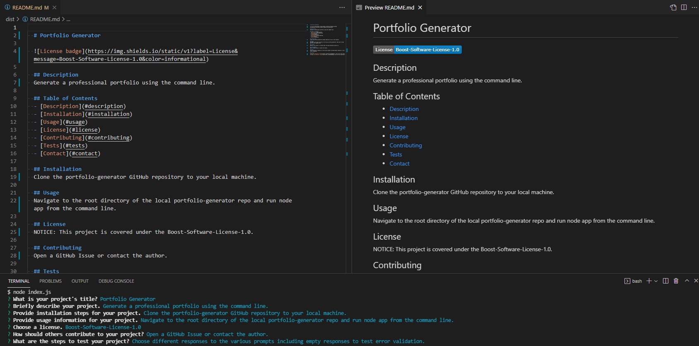

# NeedMe-A-README

## Description
NeedMe-A-README helps you generate a professional README file for your projects so you can focus on more meaningful coding and let technology do the work for you!

_App Sample Screenshot_

### Access

Clone the repository to your local machine, navigate to the root directory of the repository, then run "node index.js" from the command line.

[Demo Video](https://watch.screencastify.com/v/9Y25ZtaEwBRvUvHHSI1e)

### Future Enhancements Roadmap

* add additional badge options
* add ability to include additional images and links
